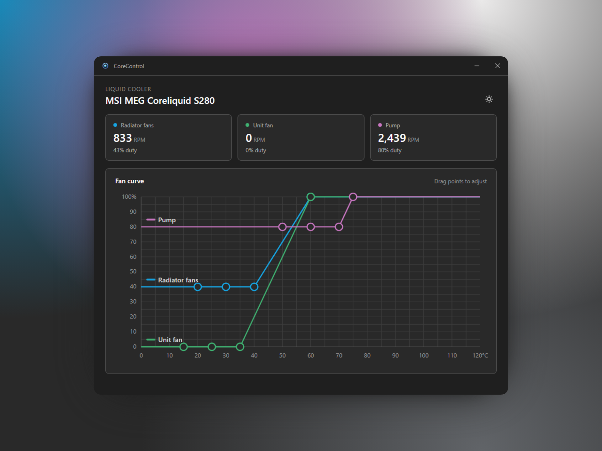

# CoreLiquid

A Rust workspace for controlling MSI MEG/MPG Coreliquid AIO coolers, with
CoreControl, a Tauri desktop app, on top.



## What it does

CoreControl detects the cooler, shows live fan speeds and duties for every
channel, lets you set a per-channel fan curve, and keeps running in the
background. It persists the saved profile and restores it if the device
drifts, for example after a firmware reset or another tool touching it.

## Supported coolers

- **MEG Coreliquid S280** — confirmed working
- **MEG Coreliquid S360** — product ID confirmed, channel mapping inferred (not verified on hardware)
- **MPG Coreliquid K360** — product ID confirmed, channel mapping inferred (not verified on hardware)

See [`lib/README.md`](lib/README.md) for exact USB IDs and channel counts.

## Install

Download the latest installer from
[GitHub Releases](https://github.com/baxelson12/corecontrol/releases) and run
it. The app is Windows-only.

## Notable behavior

- Runs in the system tray; launching the exe again reveals the running instance instead of starting a second one.
- Optional run-at-startup, which launches minimized to the tray.
- A background watchdog reapplies the saved profile if the cooler's running profile drifts (firmware reset, another tool), with a toast or OS notification.
- Checks GitHub for a newer release on startup and announces it.

## For developers

### Layout

```
Cargo.toml        workspace root
lib/              the control library (USB HID protocol), see lib/README.md
app/              CoreControl, the Tauri desktop app
  src/            React + Fluent UI frontend
  src-tauri/      Rust backend (Tauri commands)
justfile          workspace tasks
```

The app consumes the library through the `Cooler` facade; see
[`lib/README.md`](lib/README.md) for the library API, or use it standalone
as a Rust dependency.

### Prerequisites

- Rust (stable) and [`just`](https://github.com/casey/just)
- [pnpm](https://pnpm.io) and Node for the frontend
- The [Tauri prerequisites](https://tauri.app/start/prerequisites/) for your OS
- For Windows: the MSVC toolchain (native) or `cargo-xwin` (cross from Linux)

### Common tasks

```
just check          # fmt + clippy + test the library
just check-ui       # type-check + lint the frontend (tsc + Biome)
just dev            # run the app with hot reload
just win            # build the Windows exe + installers (run on Windows)
just win-exe        # cross-compile just the Windows exe from Linux
just win-installer  # cross-build the NSIS installer from Linux (needs nsis)
just patch          # bump the patch version, commit, and tag (minor/major too)
```

### CI and releases

GitHub Actions (`.github/workflows/`) runs the library and frontend checks
on every push to `main` and on pull requests. Pushing a `v*` tag builds the
Windows installers and drafts a GitHub release with them attached; publish
the draft to make it public.

To cut a release, run `just patch`, `just minor`, or `just major`. It bumps
the app version everywhere it lives, commits, and creates the matching tag.
The tag must match the app version or the workflow attaches the installers
to the wrong release. Nothing is pushed; release with the printed
`git push` command.
